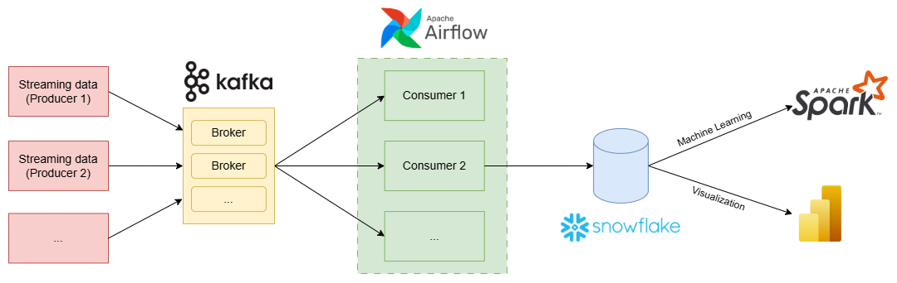
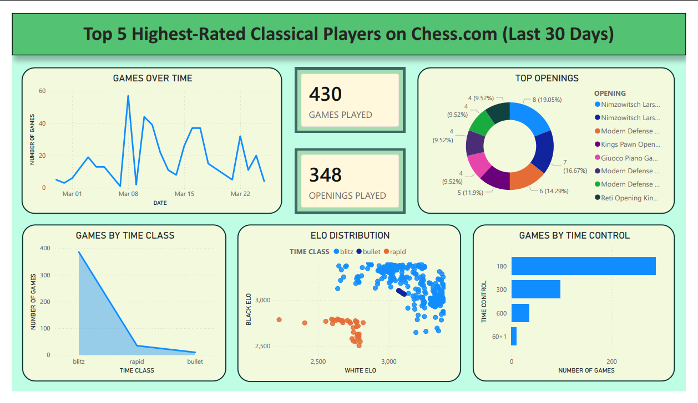

# Big Data ETL Pipeline for Chess.com Games Dataset

## 📌 Author
- Vu Hoang Nhat Truong - University of Science, VNUHCM.

## 📌 Overview
This project implements an **ETL (Extract - Transform - Load) pipeline** using modern **Big Data technologies** and a **Data Warehouse architecture**.  

The main objective is to process and analyze chess game data from Chess.com, with a strong focus on **streaming data processing**. The system supports large-scale data ingestion, real-time data streaming, transformation and visualization. It is designed to simulate a real-world data engineering pipeline and generate meaningful insights from gameplay data.

## 📌 Objectives
- Design and implement a complete **end-to-end ETL pipeline**.  

- Apply **Big Data tools** in a practical scenario.  

- Process **streaming data** efficiently.  

- Analyze chess gameplay data.  

- Predict player performance using machine learning techniques.  

- Present insights through interactive dashboards.  

## 📌 Technologies Used
- Apache Kafka.

- Apache Airflow.  

- Apache Spark.  

- Snowflake (Data Warehouse).  

- Microsoft Power BI (Visualization).  

- Python. 

## 📌 Notes
- This project is intended for **learning and academic purposes only**.  

- Data is collected from the **public Chess.com API** (https://api.chess.com).  

## 📌 Dataset Description
The dataset consists of **Chess.com games from 2025 onward**, collected from the **Top 5 highest ELO players in the world (as of March 23, 2026)**:

- **Players included:**
  - Magnus Carlsen.

  - Hikaru Nakamura.  

  - Fabiano Caruana.  

  - Nodirbek Abdusattorov.  

  - Vincent Keymer.  

- **Data source:**
  - Retrieved via the **Chess.com API**.  

- **Key attributes:**

  - Player information.  

  - Match timestamps.  

  - Game results.  

  - PGN (Portable Game Notation).  

## 📌 System Architecture

### 1. Data Ingestion (Producers)
- A **simulated producer** is used to collect data from the **Chess.com API**.  

- Raw data is continuously generated and pushed into the pipeline, simulating a **real-time data stream**.  

### 2. Streaming with Kafka
- **Apache Kafka** acts as the central message broker. 

- Data is published into **Kafka topics** in a streaming manner.  

- This enables **real-time data processing** and decouples producers from consumers.  

- Multiple consumers can subscribe and process the same data stream for different purposes.  

### 3. Data Processing (Consumers)

#### Consumer 1 - Data Transformation
- Processes and cleans streaming data.  

- Transforms raw input into structured format.  

- Loads the processed data into the **Snowflake Data Warehouse**.  

#### Consumer 2 - Move Visualization
- Parses **PGN (Portable Game Notation)** data.  

- Reconstructs and visualizes chess moves from streaming input.  

#### Consumer 3 - Real-time Data Delivery
- Continuously streams transformed data into a **Power BI Streaming Dataset**.  

- Enables downstream visualization systems to consume real-time data.   

### 4. Workflow Orchestration
- **Apache Airflow** is responsible for:

    - Scheduling and triggering consumer execution.  

    - Running consumer jobs on a **daily basis**.  

    - Managing dependencies between consumer tasks.    

### 5. Machine Learning with Apache Spark
- **Apache Spark** is utilized to:

  - Train machine learning models (Linear Regression).  

  - Predict future **ELO ratings** based on historical data.  

### 6. Data Visualization
- **Power BI** is used to:

  - Build interactive dashboards via **Snowflake Data Warehouse** or **Power BI Streaming Dataset** (configured on Power BI Service for real-time data ingestion).  

  - Deliver actionable insights from both historical and real-time data.  

